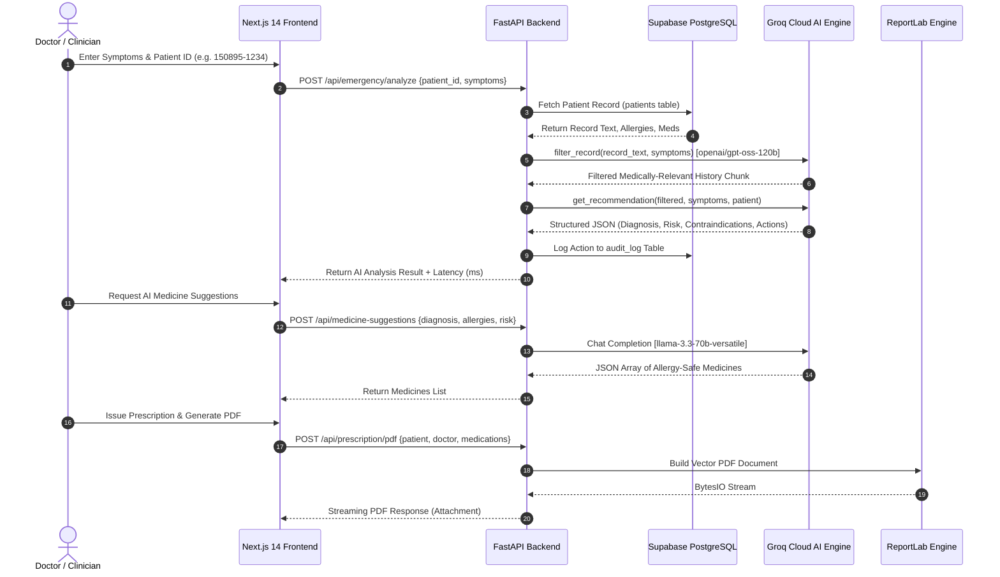

# Smriti Patient History Analyzer 🏥

> **Full-stack AI-Powered Emergency Medical History Analyzer & Intelligent Patient Record Management Platform**  
> *Developed by **Team Asclepius** | Sharda University | Smart India Hackathon (SIH) 2025*

[](https://nextjs.org/)
[](https://fastapi.tiangolo.com/)
[](https://python.org/)
[](https://www.typescriptlang.org/)
[](https://tailwindcss.com/)
[](https://supabase.com/)
[](https://groq.com/)

---

## 📋 Table of Contents
1. [Project Title & Tagline](#1-project-title-and-tagline)
2. [Project Overview](#2-project-overview)
3. [Problem Statement](#3-problem-statement)
4. [Our Solution](#4-our-solution)
5. [How Smriti Works](#5-how-smriti-works)
6. [System Architecture & Data Flow](#6-system-architecture--data-flow)
7. [Key Features](#7-key-features)
8. [AI / LLM Capabilities](#8-aillm-capabilities)
9. [Technical Architecture](#9-technical-architecture)
10. [Tech Stack](#10-tech-stack)
11. [Project Structure](#11-project-structure)
12. [API / Backend Overview](#12-apibackend-overview)
13. [Patient History Analysis Workflow](#13-patient-history-analysis-workflow)
14. [Database & Storage Schema](#14-databasestorage)
15. [Installation and Setup](#15-installation-and-setup)
16. [Environment Variables](#16-environment-variables)
17. [How to Run Frontend](#17-how-to-run-frontend)
18. [How to Run Backend](#18-how-to-run-backend)
19. [Example Workflow](#19-example-workflow)
20. [Example Patient-History Analysis Output](#20-example-patient-history-analysis-output)
21. [Security & Privacy Considerations](#21-securityprivacy-considerations)
22. [Future Improvements](#22-future-improvements)
23. [Team & Project Information](#23-teamproject-information)

---

## 1. Project Title and Tagline

**Smriti Patient History Analyzer**  
*Emergency Clinical Intelligence & Unified Longitudinal Patient Record Platform*

---

## 2. Project Overview

**Smriti** is a production-ready, full-stack healthcare platform engineered to solve the critical problem of fragmented medical histories during emergency admissions and routine consultations. Built with Next.js 14, FastAPI, Supabase PostgreSQL, and Groq Cloud LLM acceleration, Smriti instantly synthesizes complex, unstructured patient records into actionable clinical insights.

Unlike generic text summarizers, Smriti implements a **two-stage context-filtering AI engine**. It extracts symptom-relevant clinical antecedents, performs automated risk triage, scans for drug-allergy contraindications, suggests clinical pharmacist-backed medication regimens, and auto-generates formal ReportLab PDF prescriptions and full record deletion archives.

---

## 3. Problem Statement

In emergency clinical settings, doctors face three life-threatening bottlenecks:

1. **Information Overload & Fragmented Data:** Patient histories exist scattered across handwritten discharge summaries, PDF scan reports, physical prescriptions, and verbal notes. During acute crises (e.g., cardiac episodes or anaphylaxis), doctors do not have time to read 50-page historical charts.
2. **Preventable Medication Errors & Contraindication Oversights:** Cross-referencing presenting symptoms against past drug allergies and ongoing prescriptions under extreme time pressure leads to inadvertent adverse drug events (ADEs).
3. **Lack of Standardized Patient Identification:** Patients frequently lack a secure, portable medical ID linked to their verified credentials, resulting in duplicate records, lost diagnostic history, and delayed emergency interventions.

---

## 4. Our Solution

**Smriti** bridges emergency care, clinical workflows, and patient data ownership:

* **Symptom-Targeted Context Filtering:** Filter hundreds of lines of medical history down to only what is relevant to the acute presenting symptom before submitting context to diagnostic AI models.
* **Algorithmic Clinical Decision Support (CDSS):** Computes primary diagnosis, diagnostic confidence score (0–100%), emergency risk level (`CRITICAL`, `HIGH`, `MEDIUM`, `LOW`), immediate lifesaving actions, recommended tests, and explicit contraindication warnings.
* **Privacy-Preserving Aadhar Patient ID System:** Generates unique, non-sensitive IDs in the format `DDMMYY-XXXX` derived from Date of Birth and the last 4 digits of Aadhar.
* **Seamless PDF Document Pipeline:** Auto-compiles professional, print-ready PDF prescriptions and downloads complete cryptographic ZIP/PDF medical archives upon record deletion.
* **Multimodal Patient Empowerment:** Features Vision-based OCR report extraction, Web Speech API voice symptom input/readout, 1-tap SOS emergency alert broadcasting with 112 routing, and multi-lingual UI (English & Hindi).

---

## 5. How Smriti Works

Smriti operates on a dual-portal architecture:

```
┌────────────────────────────────────────────────────────────────────────────────────────┐
│                                   SMRITI PLATFORM                                      │
├───────────────────────────────────────────┬────────────────────────────────────────────┤
│              DOCTOR PORTAL                │               PATIENT PORTAL               │
│                                           │                                            │
│  1. Search / Link Patient ID (DDMMYY-XXXX)│  1. Authenticate via Email OTP             │
│  2. Input Presenting Symptoms (Text/Voice)│  2. View Aadhar-derived Patient ID         │
│  3. Run 2-Stage Groq AI Clinical Analysis │  3. Track Vitals & Set Medicine Reminders  │
│  4. Review Diagnosis & Allergy Alerts     │  4. Upload Lab Reports (Vision OCR)       │
│  5. Fetch AI Medicine Suggestions & Issue │  5. Query Segmented AI Symptom Assistant   │
│     ReportLab PDF Prescriptions           │  6. Trigger 1-Tap SOS Emergency Broadcast  │
└───────────────────────────────────────────┴────────────────────────────────────────────┘
```

1. **Patient Onboarding:** The patient registers using Email OTP. Entering their Date of Birth and last 4 Aadhar digits generates their unique `DDMMYY-XXXX` identifier.
2. **Clinical Search & Linking:** A doctor searches or links the patient ID on their dashboard to access real-time medical history, past prescriptions, and vitals.
3. **Symptom Input & Context Processing:** The doctor inputs current symptoms via typing or Web Speech recognition.
4. **AI Emergency Analysis:** FastAPI triggers `filter_record` to prune irrelevant record history using Groq LLM, followed by `get_recommendation` to evaluate diagnostic risk and contraindications.
5. **Prescription & PDF Export:** The doctor selects AI-suggested or custom medications and clicks **Submit Prescription**, triggering ReportLab to compile a downloadable vector PDF.
6. **Data Safeguarding:** If a patient record is deleted, an automated PDF archive generator packages all clinical notes, vitals, and prescriptions for the user before purge execution.

---

## 6. System Architecture & Data Flow



---

## 7. Key Features

### 🩺 Doctor Capabilities
* **Instant ID Lookup & Linking:** Fast search by patient ID (`DDMMYY-XXXX`) with profile preview and clinical roster association (`patient_doctor_links`).
* **4-Tab Patient Deep Dive:**
  1. **Overview:** Interactive 4-vital dashboard (BP, Heart Rate, Glucose, Body Temp) with live range indicators and full medical record timeline.
  2. **Clinical Notes:** Manual consultation note entry stored directly to PostgreSQL.
  3. **AI Emergency Analyzer:** Real-time Groq AI diagnostic engine with voice input and text-to-speech readouts.
  4. **Prescriptions:** AI medication suggestions + manual dosage entry with automatic PDF prescription compilation.
  5. **Diagnostics & Vitals:** Historical vitals monitoring with **Smartwatch Wearable Simulator**.
  6. **Documents:** Lab scan repository backed by Supabase Storage.
* **Safe Patient Deletion & Archive Export:** Safeguarded deletion modal that auto-compiles and downloads a full `patient_archive_[id].pdf` before removing database rows.

### 👤 Patient Capabilities
* **Seamless Email OTP Auth:** Secure login via email verification code, generating custom tokens.
* **Aadhar-Derived ID Generator:** Automatically creates deterministic IDs (`DDMMYY-XXXX`) without storing sensitive full Aadhar numbers.
* **Interactive Health Dashboard:** Monitor vitals, log custom measurements, set active medicine reminders, and manage emergency contacts.
* **Medical Report Scan & Vision OCR:** Dropzone document uploader for PDF/JPG/PNG reports with LLM Vision text extraction (`llama-3.2-11b-vision-preview`).
* **AI Symptom Assistant:** Segmented chat interface returning structured medical advice, hospital map queries (`mapQuery`), recommended specialists, and emergency flags.
* **1-Tap SOS Emergency Broadcast:** Immediate alert trigger logging to `audit_log` with instant `tel:112` phone routing.
* **Multi-Lingual UI:** Instant toggle between English and Hindi interface translations.

---

## 8. AI/LLM Capabilities

Smriti leverages state-of-the-art models hosted on Groq Cloud to ensure ultra-low latency (< 1.5s) emergency responses:

| AI Functionality | Model | Purpose & Output Format |
|---|---|---|
| **Medical History Filtering** | `openai/gpt-oss-120b` | Distills raw, verbose historical text down to concise symptom-relevant context chunks. |
| **Emergency Risk & CDSS** | `openai/gpt-oss-120b` | Generates structured JSON containing `primary_diagnosis`, `confidence` %, `risk_level`, `immediate_actions`, `contraindications`, and `further_tests`. |
| **Clinical Pharmacist Drug Suggestion** | `llama-3.3-70b-versatile` | Analyzes diagnosis, risk, and known patient allergies to output a JSON array of 8–10 safe medicine recommendations with dosage. |
| **Vision Report OCR** | `llama-3.2-11b-vision-preview` | Extracts structured medical data (diagnosis, lab metrics, test dates) directly from base64 document images. |
| **Segmented Patient Chat** | `llama-3.3-70b-versatile` | Multi-field JSON response classifying symptoms into causes, specialist recommendation, Google Maps search string, and urgency rating. |

---

## 9. Technical Architecture

Smriti follows a clean separation of concerns between client rendering, backend business logic, AI orchestration, and relational data storage:

```
Smriti Architecture
 ├── Next.js 14 Client Layer (React 18 + Tailwind CSS + Lucide Icons)
 │    ├── App Router Page Handlers (/doctor, /patient, /auth, /about)
 │    ├── Web Speech API (SpeechRecognition + SpeechSynthesis)
 │    ├── Next.js API Routes (/api/upload for Supabase Storage)
 │    └── LocalStorage Cache (Patient Sessions & Base64 Avatar Caching)
 ├── FastAPI Backend Services (Python 3.10+ Async Engine)
 │    ├── Routers & Schemas (Pydantic Models)
 │    ├── Groq Service (AsyncGroq Client with JSON Response Enforcements)
 │    ├── Database Service (Supabase Python SDK Client)
 │    ├── ReportLab Engine (Custom PDF Styles, Tables, & Headers)
 │    └── Email Dispatcher (SMTP TLS & Firebase Token Handlers)
 └── Data & Storage Layer (Supabase Cloud PostgreSQL)
      ├── Relational Tables (patients, user_profiles, prescriptions, vitals, etc.)
      ├── Object Storage Buckets (documents01)
      └── Audit Logging System (audit_log)
```

---

## 10. Tech Stack

| Category | Technology |
|---|---|
| **Frontend Framework** | [Next.js 14.2.5](https://nextjs.org/) (React 18, App Router) |
| **Language** | [TypeScript 5](https://www.typescriptlang.org/) & JavaScript (ES6+) |
| **Styling** | [Tailwind CSS 3.4](https://tailwindcss.com/) & Custom Glassmorphism UI |
| **Icons** | [Lucide React](https://lucide.dev/) |
| **Backend Framework** | [FastAPI](https://fastapi.tiangolo.com/) (Python 3.10+) |
| **ASGI Server** | [Uvicorn](https://www.uvicorn.org/) |
| **AI Infrastructure** | [AsyncGroq SDK](https://github.com/groq/groq-python) (Groq Cloud LLMs) |
| **Database & Auth** | [Supabase](https://supabase.com/) (PostgreSQL 15 & JS/Python SDKs) |
| **PDF Generation** | [ReportLab](https://www.reportlab.com/) (Python PDF Graphics Engine) |
| **Authentication** | Email OTP via Python `smtplib` + Optional Firebase Admin SDK |
| **Document Processing**| `react-dropzone` + Base64 Image Processing |

---

## 11. Project Structure

```
smriti_FINAL (2)/smriti-final/
├── app/                        # Next.js 14 App Router Directory
│   ├── about/                  # About & Team Asclepius page
│   │   └── page.tsx
│   ├── api/                    # Next.js Serverless Routes
│   │   ├── request-otp/        # OTP request proxy
│   │   ├── upload/             # Document upload route (Supabase Storage)
│   │   │   └── route.js
│   │   └── verify-otp/         # Firebase OTP verification proxy
│   ├── auth/                   # Unified Auth Page (Doctor & Patient tabs)
│   │   └── page.tsx
│   ├── components/             # Reusable UI Components
│   │   ├── Navbar.tsx
│   │   └── UploadTab.tsx
│   ├── doctor/                 # Doctor Workspace Pages
│   │   ├── page.tsx            # Main Doctor Dashboard & Search Roster
│   │   └── patient/[id]/       # Detailed 6-Tab Patient Clinical View
│   │       └── page.tsx
│   ├── patient/                # Patient Portal Workspace Page
│   │   └── page.tsx
│   ├── globals.css             # Global Tailwind Styles
│   ├── layout.tsx              # Root App Layout
│   └── page.tsx                # Landing Page (Doctor/Patient choice)
├── backend/                    # FastAPI Backend Application
│   ├── app/
│   │   ├── __init__.py
│   │   ├── main.py             # FastAPI App, Endpoints, & PDF Generators
│   │   └── services/
│   │       ├── __init__.py
│   │       ├── db_service.py   # Supabase Client & Query Helpers
│   │       └── groq_service.py # Groq LLM Filter & Recommendation Pipeline
│   └── requirements.txt        # Python Dependencies
├── lib/                        # Core Utilities & Configurations
│   └── supabase.ts             # Supabase JS Client Instance
├── public/                     # Static Assets & Logos
├── supabase_setup.sql          # Initial PostgreSQL Database Schema
├── supabase_v3_migration.sql   # V3 Schema Migrations (Aadhar, Vitals, Audit)
├── .env.local                  # Next.js Environment Configuration
├── package.json                # Frontend Package Configuration
├── tailwind.config.js          # Tailwind Configuration
└── tsconfig.json               # TypeScript Configuration
```

---

## 12. API/Backend Overview

The FastAPI backend exposes endpoints for patient management, AI processing, document compilation, and authentication:

| Method | Endpoint | Description | Request Body / Parameters |
|---|---|---|---|
| `GET` | `/` | API Status & Health Check | None |
| `GET` | `/api/patients` | Fetch all registered patients | None |
| `GET` | `/api/patients/{id}` | Fetch patient details by ID | Path parameter `id` |
| `POST` | `/api/patients` | Register new patient record | `NewPatient` JSON |
| `DELETE` | `/api/patients/{id}` | Delete patient record | Path parameter `id` |
| `PATCH` | `/api/patients/{id}/allergies` | Update patient allergy string | `AllergyUpdate` JSON |
| `GET` | `/api/stats` | Return aggregate portal stats | None |
| `POST` | `/api/emergency/analyze` | 2-Stage Groq AI history filter & risk triage | `AnalyzeRequest` JSON |
| `POST` | `/api/medicine-suggestions` | AI Clinical Pharmacist medication suggestions | `MedSuggestionRequest` JSON |
| `POST` | `/api/chat-segmented` | AI Patient Assistant segmented response | `ChatRequest` JSON |
| `POST` | `/api/ocr` | LLM Vision document OCR text extraction | `OCRRequest` (base64 image) |
| `POST` | `/api/prescription/pdf` | Build & stream downloadable prescription PDF | `PrescriptionPDFRequest` |
| `POST` | `/api/patient/archive-pdf` | Build & stream full record PDF archive | `ArchivePDFRequest` |
| `POST` | `/api/sos` | Trigger emergency SOS alert & audit log | `SOSRequest` |
| `POST` | `/api/request-email-otp` | Dispatch 6-digit email OTP | `EmailOTPRequest` |
| `POST` | `/api/verify-email-otp` | Verify email OTP & issue token | `VerifyEmailOTPRequest` |

---

## 13. Patient History Analysis Workflow

When a doctor inputs symptoms for a patient:

```
[ Raw Patient Record in Supabase ]  ──► (e.g. 500+ words of past surgeries, chronic conditions, lifestyle notes)
                  │
                  ▼
   [ Step 1: filter_record ]        ──► Model: openai/gpt-oss-120b
                  │                     Extracts ONLY history relevant to current symptoms (e.g. "Chest Pain")
                  ▼
 [ Step 2: get_recommendation ]     ──► Model: openai/gpt-oss-120b
                  │                     Receives filtered history + presenting symptoms + allergies + meds
                  ▼
   [ Step 3: Structured JSON ]      ──► Primary Diagnosis, Confidence Score, Risk Level, Immediate Actions,
                                        Contraindication Alerts, Further Tests, Reasoning Summary
                  │
                  ▼
[ Step 4: Medicine Suggestions ]   ──► Model: llama-3.3-70b-versatile
                                        Recommends 8-10 non-allergenic drugs with exact dosages
```

---

## 14. Database/Storage

The database runs on **Supabase PostgreSQL**. Below is the table schema configured in `supabase_setup.sql` & `supabase_v3_migration.sql`:

```sql
-- Core Patient Table
CREATE TABLE patients (
  id TEXT PRIMARY KEY,          -- Format: DDMMYY-XXXX
  name TEXT NOT NULL,
  age INT,
  gender TEXT,
  blood_type TEXT,
  allergies TEXT,
  medications TEXT,
  record_text TEXT,
  dob DATE,
  aadhar_last4 TEXT,
  profile_image TEXT,
  created_at TIMESTAMPTZ DEFAULT NOW()
);

-- Doctor Notes Table
CREATE TABLE doctor_notes (
  id SERIAL PRIMARY KEY,
  patient_id TEXT NOT NULL,
  doctor_name TEXT,
  note TEXT,
  created_at TIMESTAMPTZ DEFAULT NOW()
);

-- Prescriptions Table
CREATE TABLE prescriptions (
  id SERIAL PRIMARY KEY,
  patient_id TEXT NOT NULL,
  doctor_name TEXT,
  medications JSONB,
  ai_diagnosis TEXT,
  notes TEXT,
  created_at TIMESTAMPTZ DEFAULT NOW()
);

-- Vitals Tracking Table
CREATE TABLE vitals (
  id SERIAL PRIMARY KEY,
  patient_id TEXT NOT NULL,
  blood_pressure TEXT,
  sugar_level TEXT,
  temperature TEXT,
  weight TEXT,
  heart_rate TEXT,
  notes TEXT,
  recorded_at TIMESTAMPTZ DEFAULT NOW()
);

-- User Profiles Table
CREATE TABLE user_profiles (
  id SERIAL PRIMARY KEY,
  user_id UUID REFERENCES auth.users(id) ON DELETE CASCADE,
  name TEXT,
  role TEXT,                     -- 'doctor' | 'patient'
  email TEXT,
  patient_id TEXT,
  mc_number TEXT,                -- Medical Council License Number
  verified BOOLEAN DEFAULT FALSE,
  profile_image TEXT,
  created_at TIMESTAMPTZ DEFAULT NOW()
);

-- Audit Log Table
CREATE TABLE audit_log (
  id SERIAL PRIMARY KEY,
  action TEXT NOT NULL,          -- 'AI_ANALYSIS', 'SOS_TRIGGERED', etc.
  performed_by TEXT,
  patient_id TEXT,
  details TEXT,
  created_at TIMESTAMPTZ DEFAULT NOW()
);

-- Supporting Tables: documents, emergency_contacts, medicine_reminders, patient_doctor_links, otp_log
```

---

## 15. Installation and Setup

### Prerequisites
* **Node.js**: v18.0 or higher
* **Python**: v3.10 or higher
* **npm**: v9.0 or higher
* **Git**

### Step 1: Clone Repository
```bash
git clone https://github.com/YourRepo/smriti-patient-portal.git
cd smriti-patient-portal
```

### Step 2: Configure Database (Supabase)
1. Log into your [Supabase Dashboard](https://supabase.com/).
2. Create a new project.
3. Open the **SQL Editor** tab.
4. Copy and paste the contents of `supabase_setup.sql` and run it.
5. Copy and paste the contents of `supabase_v3_migration.sql` and run it.
6. Create a public Storage Bucket named `documents01`.

---

## 16. Environment Variables

Create `.env.local` in the root directory (for Next.js) and `.env` in the `backend/` directory (for FastAPI).

### Frontend Configuration (`.env.local`)
```env
NEXT_PUBLIC_SUPABASE_URL=https://your-supabase-id.supabase.co
NEXT_PUBLIC_SUPABASE_ANON_KEY=your-supabase-anon-key
NEXT_PUBLIC_API_URL=http://localhost:8000
```

### Backend Configuration (`backend/.env`)
```env
GROQ_API_KEY=gsk_your_groq_api_key_here
SUPABASE_URL=https://your-supabase-id.supabase.co
SUPABASE_KEY=your-supabase-anon-key
SMTP_EMAIL=your-gmail@gmail.com           # (Optional: For sending real Email OTPs)
SMTP_PASSWORD=your-app-password           # (Optional: Gmail App Password)
SMTP_SERVER=smtp.gmail.com
SMTP_PORT=587
FIREBASE_SERVICE_ACCOUNT_PATH=            # (Optional: Path to firebase service account JSON)
```

---

## 17. How to Run Frontend

```bash
# Navigate to the frontend directory
cd smriti-final

# Install dependencies
npm install

# Start development server
npm run dev
```

Open [http://localhost:3000](http://localhost:3000) in your browser.

---

## 18. How to Run Backend

```bash
# Open a new terminal and navigate to the backend directory
cd smriti-final/backend

# Create a virtual environment (Windows)
python -m venv venv
venv\Scripts\activate

# Create a virtual environment (Mac/Linux)
# python3 -m venv venv
# source venv/bin/activate

# Install Python requirements
pip install -r requirements.txt

# Start FastAPI application using Uvicorn
uvicorn app.main:app --reload --port 8000
```

The API will be live at [http://localhost:8000](http://localhost:8000). Interactive Swagger docs are accessible at [http://localhost:8000/docs](http://localhost:8000/docs).

---

## 19. Example Workflow

Here is a typical end-to-end clinical workflow using Smriti:

```
[1. Patient Registration] ──► Patient inputs DOB (15 Aug 1995) & Aadhar last 4 (1234)
                             ──► Auto-generates Patient ID: 150895-1234
                                  │
[2. Emergency Consult]    ──► Patient arrives at ED with acute chest pain and dyspnea
                             ──► Doctor searches "150895-1234" on Doctor Dashboard
                                  │
[3. AI History Analysis]  ──► Doctor inputs symptoms: "Severe retrosternal chest pain, radiating to left arm"
                             ──► Groq AI filters history & computes risk: CRITICAL (Confidence: 94%)
                             ──► Contraindication Alert: "Patient allergic to Aspirin (causes Anaphylaxis)"
                                  │
[4. Prescription & PDF]   ──► Doctor selects alternative anticoagulant (Clopidogrel) + Nitroglycerin
                             ──► Clicks "Submit & Export PDF" -> Generates vector prescription PDF
                                  │
[5. Audit & Archiving]    ──► Action logged to audit_log table. Record printable or archivable as PDF.
```

---

## 20. Example Patient-History Analysis Output

When calling `POST /api/emergency/analyze`, the FastAPI backend returns this response schema:

```json
{
  "primary_diagnosis": "Acute Coronary Syndrome (Possible NSTEMI)",
  "confidence": 92,
  "risk_level": "CRITICAL",
  "immediate_actions": [
    "Administer Supplemental Oxygen to maintain SpO2 > 94%",
    "Obtain immediate 12-lead ECG",
    "Establish IV access and draw Cardiac Biomarkers (Troponin I/T)",
    "Administer Sublingual Nitroglycerin 0.4mg if BP > 100 mmHg"
  ],
  "medications": [
    {
      "name": "Clopidogrel",
      "dose": "300 mg loading dose",
      "route": "oral"
    },
    {
      "name": "Atorvastatin",
      "dose": "80 mg",
      "route": "oral"
    }
  ],
  "contraindications": [
    "CONTRAINDICATION WARNING: Aspirin is listed under patient allergies (Anaphylactic Reaction history). Avoid NSAIDs/Aspirin."
  ],
  "further_tests": [
    "Serial 12-Lead ECG at 0, 15, and 30 minutes",
    "High-Sensitivity Cardiac Troponin T",
    "Echocardiogram to assess wall motion abnormalities",
    "Bedside Chest X-Ray"
  ],
  "reasoning": "Patient presents with classic ischemic chest pain radiating to left arm. Past medical history indicates hypertension and hyperlipidemia. Given known Aspirin allergy, dual antiplatelet therapy must use Clopidogrel as primary antiplatelet agent.",
  "patient_name": "Priya Sharma",
  "patient_id": "150895-1234",
  "latency_ms": 1140
}
```

---

## 21. Security/Privacy Considerations

* **Deterministic Anonymized Patient IDs (`DDMMYY-XXXX`):** Full 12-digit Aadhar numbers are **never stored** in the database. Only the non-sensitive last 4 digits are combined with Date of Birth to produce a deterministic ID.
* **Audit Logging System:** Critical operations (AI emergency analysis, SOS alerts, patient registration, deletion) write immutable entries to the `audit_log` PostgreSQL table with timestamp and actor attribution.
* **Supabase Row-Level Security (RLS):** Database setup scripts include pre-configured RLS policies for authenticated users and anonymous sessions.
* **Client-Side PDF Compilation & Ephemeral Streaming:** ReportLab buffers PDFs entirely in memory (`io.BytesIO()`) and streams binary data over HTTPS directly to client browsers without saving unencrypted temporary files on server disks.

---

## 22. Future Improvements

* **ABDM / ABHA Health ID Integration:** Native sync with India's Ayushman Bharat Digital Mission (ABDM) sandbox APIs for universal interoperability.
* **Edge LLM Quantization & Offline Mode:** Deploying lightweight quantized local models (e.g. Ollama / Llama.cpp) on hospital edge nodes to allow emergency analysis during internet outages.
* **Wearable IoT Hardware Integration:** Live Web Bluetooth LE integration with smartwatches and continuous glucose monitors (CGMs) for automatic vitals telemetry streaming.
* **FHIR (Fast Healthcare Interoperability Resources) Export:** Standardizing output schemas to compliant HL7 FHIR JSON objects.

---

## 23. Team/Project Information

**Team Asclepius**  
*Sharda University | Smart India Hackathon (SIH) 2025*

* **Track:** Healthcare & MedTech
* **Solution Name:** Smriti — Smart Patient History & Medical Systems
* **Repository:** Full-Stack Next.js + FastAPI Workspace

---
*Generated for hackathon evaluation and developer reproduction. Built with ❤️ by Team Asclepius.*
